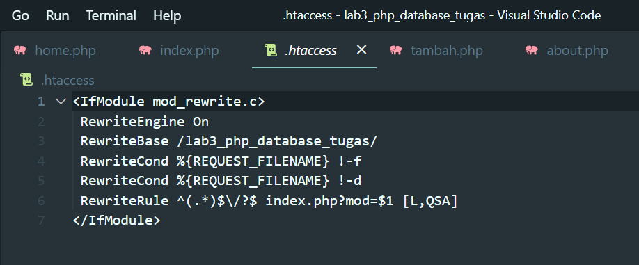

# PRATIKUM 4: PHP MODULAR

**Nama : Nurul Najwa Sabilla**  
**Kelas : TI.21.A.3**  
**Nim : 312110451**  

## Membuat Folder Baru
Buat folder baru dengan nama lab4_php_modular pada docroot webserver (htdocs).

## Membuat File Baru
- Buat file baru dengan nama header.php
- Buat file baru dengan nama footer.php
- Buat file baru dengan nama home.php
- Buat file baru dengan nama about.php
- Buat file baru dengan nama style.css

Untuk source code dapat dilihat pada file github ini Lab4Web folder lab4_php_modular.

## Membuat Routing
Routing digunakan untuk mempermudah akses halaman web agar SEO Friendly. Langkah awal adalah menyiapkan file utama (index.php) yang berisi routing untuk mengakses request halaman.

1. Buat file baru dengan nama index.php
Dengan source code ini :

Untuk akses url pada masing-masing hamalan sebagai berikut :
- Halaman Home (localhost/lab4_php_modular/home.php?mod=home)
- Halaman About (localhost/lab4_php_modular/about.php?mod=about)
- Halaman Contact (localhost/lab4_php_modular/contact.php?mod=contact)

Terlihat pada url masih menggunakan query string (contohnya: ?mod=home).
Untuk itu menggunakan aktivitasi mod_rewrite.

Berikut adalah output :

## Membuat Aktivasi mod_rewrite (.htaccess)
Mod_rewrite digunakan untuk mengubah URL dari query string menjadi SEO Friendly atau mempersingkat url.

1.  Buat file baru dengan nama .htaccess
Dengan source code ini :

- Halaman Home (http://localhost/lab4_php_modular/home)
- Halaman About (http://localhost/lab4_php_modular/about)
- Halaman Contact (http://localhost/lab4_php_modular/contact)

Berikut adalah output :

## Implementasi PHP Modular pada Lab3Web
Implementasi atau penerapan ini untuk folder Lab3Web memiliki struktur website yang bagus. Dan membuat
akses url yang lebih SEO Friendly daripada sebelumnya.

1. Membuat folder baru dengan nama lab3_php_database_tugas
2. Mengisi kembali file seperti di lab3_php_database dan lab4_php_modular. Source code dapat dilihat 
pada github ini Lab4Web folder lab3_php_database_tugas
3. Membuat tambahan file baru yang sebelumnya belum ada di Lab3Web, yaitu:
- index.php untuk routing pada folder lab3_php_database_tugas

- .htaccess digunakan untuk mengubah URL dari query string menjadi SEO Friendly atau mempersingkat url.

Untuk akses url pada masing-masing hamalan, berikut hasilnya :
- Halaman Home (http://localhost/lab3_php_database_tugas/home)
- Halaman About (http://localhost/lab3_php_database_tugas/about)
- Halaman Contact (http://localhost/lab3_php_database_tugas/contact)
- Halaman Tambah Barang (http://localhost/lab3_php_database_tugas/tambah)
- Halaman Ubah Barang (http://localhost/lab3_php_database_tugas/ubah?id=17)

Berikut adalah output :

